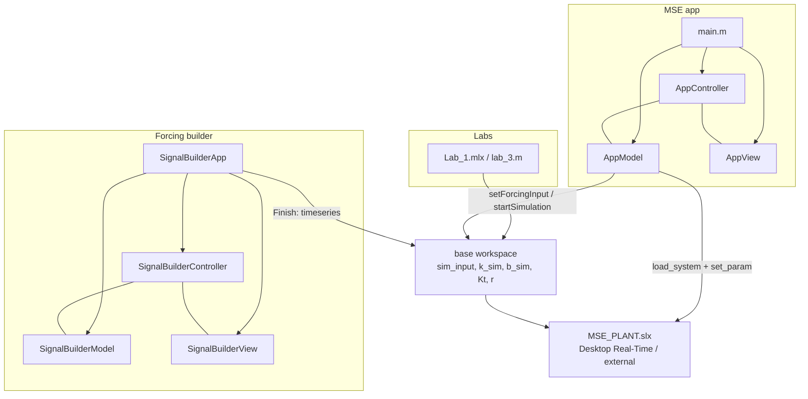

# Architecture

This repository is the MATLAB software for CMU **24-452 Mechanical Systems Experimentation**. Students drive an EMB spring–mass–damper (SMD) kit from [ROBOTS5](https://www.robots5.com/) through Simulink Desktop Real-Time.

There are three layers that share the same plant and the same workspace variables:

1. **Lab live scripts** (`src/Lab_1.mlx`, `src/lab_1.m`, `src/lab_3.m`) — course experiments that build `sim_input` by hand and start `MSE_PLANT`.
2. **Forcing function builder** (`src/App/components/forcing_builder/`) — a self-contained MVC UI that produces a `timeseries` named `sim_input`.
3. **MSE app** (`src/App/`) — the student-facing window (time/frequency plots, simulated stiffness/damping, start/stop). Still being wired to the plant.



## MVC convention

Every UI follows **Model / View / Controller**:

| Piece | Owns | Must not own |
| --- | --- | --- |
| Model | Data and Simulink / math | uifigure widgets |
| View | Layout and widgets | Business rules |
| Controller | Listeners and callbacks | Widget construction |

The forcing builder is the complete example of this split. The main app uses the same names (`AppModel`, `AppView`, `AppController`) but several callbacks are still stubs.

View classes expose **function-handle properties** (`AddCallback`, `fwdRunSimCallback`, …). The controller assigns those handles in its constructor. That keeps `uibutton` callbacks inside the view while the controller decides what happens.

## MATLAB path

From a MATLAB session whose current folder is the repo root:

```matlab
addpath(genpath('src/App'));
addpath('src');   % MSE_PLANT.slx, lab scripts
```

Image files for the sidebar (`sim_start.png`, `sim_stop.png`, `robots5_logo.png`) live in `src/App/components/Images/`. Put that folder on the path or MATLAB will not find the icons.

## Shared contract with the plant

`MSE_PLANT.slx` runs in **external** (Desktop Real-Time) mode and reads from the **base workspace**:

| Variable | Meaning |
| --- | --- |
| `sim_input` | `timeseries` of commanded force [N] vs time [s] |
| `k_sim` | Simulated extra stiffness [N/m] |
| `b_sim` | Simulated extra damping [N·s/m] |
| `T` | Sample time [s] (labs set this; default 0.001) |
| `Kt`, `r`, `motor_eff` | Actuator conversion (torque constant, pinion radius, efficiency) |

`AppModel.setForcingInput` and `SignalBuilderApp` both write `sim_input` with `assignin('base', ...)`. Lab scripts do the same after they plot a hand-built waveform.

## What is finished vs still stubbed

**Done**

- Signal math (`signals/`) and the forcing-builder UI (`SignalBuilderApp`)
- Main window layout (`AppView`, `TimePanel`, `FrequencyPanel`, `SidebarPanel`)
- Loading `MSE_PLANT` and pushing `sim_input` / stop time (`AppModel`)

**Not wired yet**

- `AppController` run-sim callback (empty)
- `SidebarPanel.runSimCallback` (empty); stop button has no callback
- `AdditionalPanel` offset/delay/dwell/repeat fields are not copied onto `BaseSignal`
- `BaseSignal.DelayBefore`, `DelayAfter`, and `Repeat` are not applied inside `evaluate`
- `main.m` constructs `AppView()` with no parent figure (the constructor expects one)

When you change behavior, prefer extending the controller rather than putting Simulink calls inside a panel.
