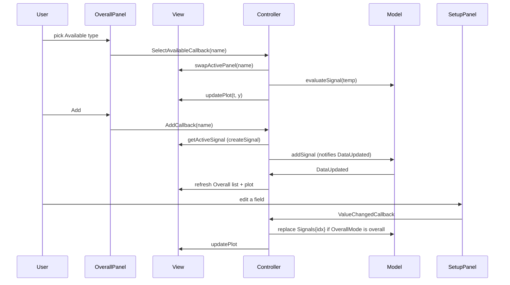

# Forcing function builder

Self-contained MVC app that lets a student pick waveform types, edit parameters, preview the plot, and export a `timeseries` for `MSE_PLANT`.

## Isolated run

```matlab
addpath(genpath('src/App'));
tsData = SignalBuilderApp;    % force [N]; blocks until Finish or close
plot(tsData);

tsData = SignalBuilderApp("Mode", "reference");   % mm + travel limit

```

On **Finish Signal Building**, `tsData` is the superimposed waveform. Closing without Finish returns an empty `timeseries` (`Length == 0`). The main app's `AppController` then calls `AppModel.setForcingInput`, which writes `sim_input` in the base workspace. `tsData.UserData` records `Quantity` (`"force"` or `"reference"`) and `Unit` (`"N"` or `"mm"`) so a leftover 3 N step cannot be treated as 3 mm.

`Mode` is chosen when the window opens. Force is commanded force [N], limit **3 N**. Reference is a displacement trajectory [mm] used when the controller is on, limit **20 mm** (`SignalQuantity.DisplacementLimit`; confirm hardware). Waveform math is unitless; only labels, y-limit lines, and the Finish alert change.

To drive the widgets from code instead of the full app:

```matlab
fig = uifigure("Name", "Forcing Function Builder", "Position", [500, 500, 940, 630]);
q = SignalQuantity.force;                 % or SignalQuantity.reference
model = SignalBuilderModel(q);
view = SignalBuilderView(fig, q);
controller = SignalBuilderController(model, view);
```

`SignalBuilderModel` can also be used with **no UI** (this is the reference comment style for the rest of the repo):

```matlab
model = SignalBuilderModel;
model.addSignal(StepSignal(2, 5, 5));
[t, y] = model.compileCompositeSignal;
plot(t, y);
model.Signals
```

## Files

```
forcing_builder/
  SignalQuantity.m            % force [N] vs reference [mm]: units, limit, UI copy
  SignalBuilderApp.m          % uifigure + uiwait; "Mode","force"|"reference"
  SignalBuilderModel.m        % cell array of BaseSignal; superposition
  SignalBuilderView.m         % 2x3 grid: plot, lists, setup, extras
  SignalBuilderController.m   % listeners + callback handles
  panels/                     % UI for lists and per-type parameters
  signals/                    % waveform math (see signals.md)
```

## Layout (940 × 630)

| Cell | Content |
| --- | --- |
| Row 1, cols 1–3 | Function Plot (`uiaxes`) |
| Row 2, col 1 | `OverallPanel` — Available list, Overall list, Add/Remove/Clear, Single/Overall switch |
| Row 2, col 2 | Function Setup — one of `*Panel` swapped in by name |
| Row 2, col 3 | `AdditionalPanel` — offset/delay/dwell/repeat + Finish |

`SignalBuilderView.swapActivePanel(name)` deletes the current setup grid and constructs `CustomPanel`, `NoisePanel`, `RampPanel`, `SinePanel`, `StepPanel`, `SweptSinePanel`, or `ZeroOutputPanel`, passing the view's `SignalQuantity` so amplitude/magnitude/slope/offset labels use N or mm.

## Data flow



**OverallMode** (`OverallPanel`):

- `'available'` — left list is selected. Plot shows a **temporary** signal from the setup panel (`evaluateSignal`). Plot switch is disabled.
- `'overall'` — right list is selected. Plot shows that stacked signal (`Single`) or the sum (`Overall`). Edits write back into `Model.Signals{idx}`.

**swapFlag**: when the Overall list changes, the setup panel is rebuilt only if the **type name** changed. Two Sines in a row keep the same panel and just `populate`.

## SignalBuilderModel

| Property / method | Behavior |
| --- | --- |
| `Quantity` | `SignalQuantity` (force vs reference). Sets `AmplitudeLimit`. |
| `AmplitudeLimit` | Reject Finish and draw red y-lines at `±Limit` (3 N or 20 mm) |
| `Signals` | Cell array of `BaseSignal` objects |
| `SampleRate` | Default 1000 Hz; sets `dt` for compiled vectors |
| `TotalDuration` | **Max** of each signal’s `TotalDuration`, not the sum |
| `addSignal` / `removeSignal` / `clearAll` | Mutate the list and fire `DataUpdated` |
| `compileCompositeSignal` | Evaluate every signal on `0:dt:TotalDuration` and **add** them |
| `evaluateIndividualSignal(idx)` | One stacked signal, on its own duration |
| `evaluateSignal(obj)` | Same, for a signal that is not in `Signals` (Available preview) |
| `resetModel` | Clears `Signals` without notifying (used by UI reset) |

Signals are **superimposed from t = 0**, not played one after another. Sequencing would use `DelayBefore` / `DelayAfter` on `BaseSignal`, which are not applied in `evaluate` yet.

## Panel contract

Every function-setup panel implements:

| Method | Purpose |
| --- | --- |
| `panel = XxxPanel(parent, quantity)` | Build controls in `parent`. Optional `quantity` (`SignalQuantity`) sets N vs mm labels; default is force. |
| `populate(signal)` | Copy a `XxxSignal` into the edit fields (Overall-list select) |
| `createSignal()` | Build a `XxxSignal` from the current fields (Add / live preview) |
| `parameterChanged()` | Call `ValueChangedCallback` so the controller refreshes the plot |

`getLayout()` returns `MainLayoutGrid` and exists for older layout code; `swapActivePanel` deletes that grid when switching types.

`AdditionalPanel` is **not** a signal panel. Finish calls `FinishCallback` → controller `uiresume`. Offset/delay/dwell/repeat fields are displayed only; they are not merged into `createSignal` yet.

## Adding a new signal type

Example: add a triangle wave named `"Triangle"`.

1. **Math** — `signals/TriangleSignal.m` subclassing `BaseSignal`, with `Name = "Triangle"`, a constructor, `TotalDuration`, and `evaluate(t)`. Copy the header style from `SineSignal`.
2. **UI** — `panels/TrianglePanel.m` with the four methods above, constructing a `TriangleSignal` in `createSignal`.
3. **Swap table** — in `SignalBuilderView.swapActivePanel`, add:

   ```matlab
   case "Triangle"
       obj.ActiveSetupPanel = TrianglePanel(obj.ForcingCanvas, obj.Quantity);
   ```

4. **Available list** — in `OverallPanel` constructor, append `"Triangle"` to `AvailableListBox` `"Items"`. The string **must match** `TriangleSignal.Name` and the `case` label.

5. Run `SignalBuilderApp` and confirm Add, Single/Overall plot, Remove, and Finish.

No change to `SignalBuilderModel` is required: it only depends on `BaseSignal`.

## Controller map

| View callback | Controller method |
| --- | --- |
| `AddCallbackView` | `handleAddCallback` → `getActiveSignal` + `addSignal` |
| `RemoveCallbackView` | `handleRemoveCallback` |
| `SelectAvailableCallbackView` | `handleSelectAvailableCallback` |
| `SelectOverallCallbackView` | `handleSelectOverallCallback` (`populate` + optional swap) |
| `ValueChangedCallbackView` | `handleValueChangedCallback` |
| `ViewSwitchCallbackView` | `handleViewSwitchChangedCallback` → `syncViewToModel` |
| `FinishCallbackView` | `handleFinishCallback` → `exceedsAmplitudeLimit`, then `IsFinished = true`, `uiresume` |

`syncViewToModel` is the single place that copies `Model.Signals` names into the Overall list and redraws the plot.
